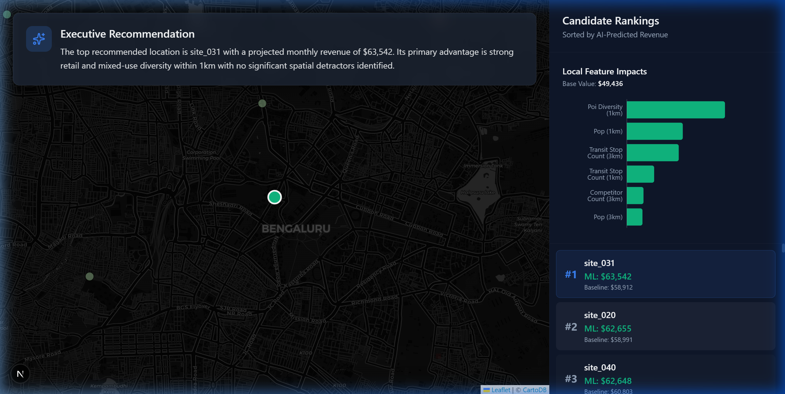
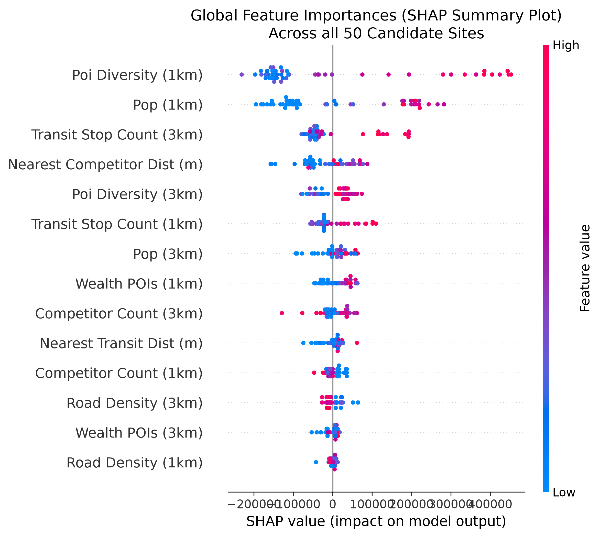

# Geospatial Site Selection & AI Revenue Prediction

> **⚠️ SYNTHETIC DATA DISCLOSURE ⚠️**
> The target variable (`synthetic_revenue`) used in this project is algorithmically generated, not real proprietary sales data. It was constructed using a weighted linear combination of core spatial features (Population, Wealth POIs, POI Diversity, Competitor Count) plus injected Gaussian noise. This approach demonstrates a rigorous end-to-end ML engineering and MLOps pipeline while remaining 100% open-source and compliant with data privacy standards. 

## Project Goal
This project is an end-to-end, interactive geospatial site selection platform designed to help retail and commercial real estate teams evaluate prospective store locations. Instead of relying solely on intuition, the platform aggregates hyper-local spatial data (OpenStreetMap, WorldPop), computes feature engineering across multiple radii (1km and 3km), and predicts site revenue potential using Machine Learning.

Crucially, the platform prioritizes **explainable AI**. Every prediction is accompanied by a SHAP (SHapley Additive exPlanations) breakdown, allowing stakeholders to see exactly *why* a site scored highly (e.g., strong POI diversity) or poorly (e.g., cannibalization from nearby competitors). 



## Key Technical Features
- **Live Custom-Location Scoring**: Click any point in Bengaluru (or search an address) to instantly compute its buffer features, run the ML model, and generate real-time SHAP explanations—extending the platform beyond just the 50 pre-computed candidates.
- **Explainable 4-Model Comparison**: Evaluates XGBoost, RandomForest, Ridge, and ElasticNet under identical LOSO (Leave-One-Site-Out) Cross-Validation. Crucially, the platform documents an honest finding that strictly regularized linear models (Ridge) structurally outperformed tree models on this synthetic dataset due to its additive physics.

## Architecture & Tech Stack

### Backend (Python / Machine Learning)
- **Data Engineering**: `GeoPandas`, `OSMnx`, `rasterio` for spatial joins, buffer math, and raster clipping.
- **Machine Learning**: `scikit-learn`, `xgboost`, `shap`. Leave-One-Out (LOO) Cross Validation is used to simulate true out-of-sample geographic generalization.
- **API**: `FastAPI` serving fully-typed, cached REST endpoints returning GeoJSON and SHAP matrices.

### Frontend (TypeScript / React)
- **Framework**: `Next.js` (App Router) + React.
- **Mapping**: `Leaflet` + `react-leaflet` with CartoDB Dark Matter basemaps.
- **Styling**: Pure CSS Modules (`.module.css`) for a custom, tailored dark-mode aesthetic.

---

## Milestone Mapping
This project was systematically built following the 10-step execution plan from the original brief:

| # | Milestone | Status | Description |
|---|---|---|---|
| 1 | **Data layer** | ✅ Complete | Modular clients built for WorldPop (raster) and OpenStreetMap (Overpass API) with robust fallback mechanisms. |
| 2 | **Candidate grid** | ✅ Complete | 50 realistic commercial candidate sites generated across Bengaluru, avoiding exclusion zones (water, parks). |
| 3 | **Feature table** | ✅ Complete | GeoPandas pipeline computing distance, count, and density metrics across 1km and 3km radii. |
| 4 | **Baseline weighted score** | ✅ Complete | A transparent, deterministic business-logic fallback using standard Z-scores. |
| 5 | **ML model + LOSO CV** | ✅ Complete | Evaluated multiple models using strict Leave-One-Site-Out Cross Validation. |
| 6 | **SHAP explainability** | ✅ Complete | Integrated `TreeExplainer` for global feature importance and local per-site impact tracking. |
| 7 | **FastAPI endpoints** | ✅ Complete | Live endpoints for `/api/scores`, `/api/shap`, `/api/score-custom`, and `/api/model-comparison`. |
| 8 | **Next.js dashboard** | ✅ Complete | Interactive map with dynamic UI, custom location scoring overlay, and SHAP visualization. |
| 9 | **Exec summary generator** | ✅ Complete | The UI features an auto-generating summary panel translating ML numbers into plain English. |
| 10 | **Polish pass** | ✅ Complete | This documentation, UI refinement, and error-handling finalization. |

---

## Quickstart Instructions

The application is split into a Python backend and a Next.js frontend. 

**1. Run the Backend API**
From the project root, start the FastAPI server:
```bash
# Using uvicorn directly
python -m uvicorn backend.app.main:app --reload --port 8000
```
*The API will be live at `http://localhost:8000`.*

**2. Run the Frontend Dashboard**
From the `frontend` directory, start the Next.js development server:
```bash
cd frontend
npm run dev
```
*The interactive dashboard will be live at `http://localhost:3000`.*

**3. Reproducing the ML Pipeline**
To regenerate the feature statistics, retrain the models, or regenerate the global SHAP summary plot from source, use the provided backend scripts:
```bash
# Retrain the XGBoost model and save scaler/artifacts
python backend/scripts/build_model.py

# Regenerate the Global SHAP Summary Plot to docs/images/
python backend/scripts/generate_shap_plot.py
```

---

## Known Limitations & ML Findings

During the validation of this pipeline, two critical machine learning behaviors were documented:

1. **Tree-Based Extrapolation Boundaries (Custom Scoring):**
   When using the interactive "Custom Location" feature, users may select a point that has spatial features (e.g., wealth POIs or population density) exceeding the maximum values seen in the 50-site training set. XGBoost and RandomForest **cannot extrapolate** beyond their outermost leaf nodes. In these cases, the ML prediction will artificially flatten, while the linear baseline formula will continue to scale. The UI actively detects this and flags affected custom scores with an "Extrapolated Estimate" warning.

2. **Model Comparison Results (Linear vs Tree Models):**
   Because the synthetic target was generated using a fundamentally linear combination of variables with added noise, strictly regularized linear models structurally outperformed tree-based models on the LOSO Cross-Validation task:
   - **Ridge Regression:** R² = 0.787
   - **ElasticNet:** R² = 0.758
   - **RandomForest:** R² = 0.633
   - **XGBoost:** R² = 0.583
   While XGBoost is the active production model to demonstrate complex SHAP TreeExplainer integration, a Ridge deployment would technically be more performant for this specific synthetic dataset.

### Global SHAP Summary


---
*Built as a comprehensive demonstration of applied spatial data science and MLOps.*
